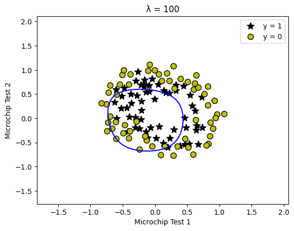
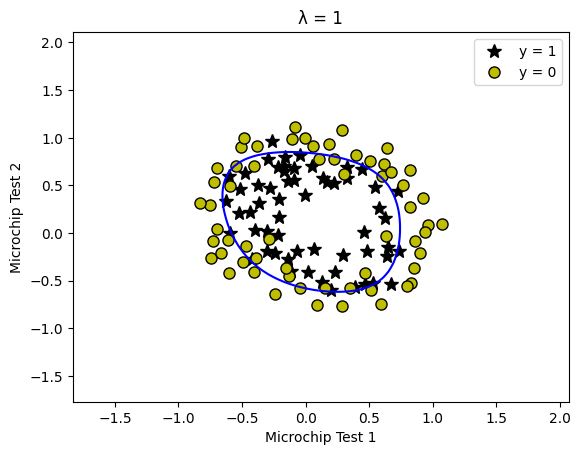
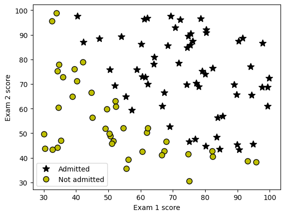
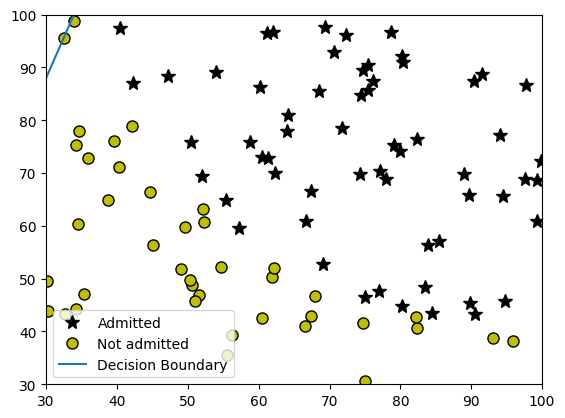

## Relatório: Regressão Logística Regularizada
## Atividade 2: da materia de Inteligência Artificial Conexionista (Mestrado UFSC)

### 1. Objetivo
Este relatório descreve a implementação de um modelo de regressão logística regularizada para classificação binária, aplicado a dois conjuntos de dados:

- **Previsão de admissão universitária** com base em notas de exames.
- **Classificação de microchips** em "aprovados" ou "rejeitados" em testes de qualidade.

### 2. Principais Etapas Implementadas

#### a) Funções Essenciais

- **Sigmoid:** Função para mapear valores contínuos em probabilidades (entre 0 e 1).

```python
def sigmoid(z):
    return 1 / (1 + np.exp(-z))
```

- **Custo e Gradiente Regularizado:** Cálculo da função de custo \( J(\theta) \) e gradiente para regressão logística com regularização L2.

```python
def costFunctionReg(theta, X, y, lambda_):
    h = sigmoid(X.dot(theta))
    termo_regularizacao = (lambda_ / (2 * len(y))) * np.sum(theta[1:]**2)
    J = (-1/len(y)) * (y @ np.log(h) + (1 - y) @ np.log(1 - h)) + termo_regularizacao
    grad = (1/len(y)) * X.T @ (h - y) + (lambda_ / len(y)) * np.concatenate([[0], theta[1:]])
    return J, grad
```

- **Previsão:** Classificação binária (0 ou 1) com base em probabilidades.

```python
def predict(theta, X):
    return (sigmoid(X.dot(theta)) >= 0.5).astype(int)
```

#### b) Mapeamento de Features Polinomiais

Transformação de 2 features originais em 28 termos polinomiais (grau 6). Exemplo de feature gerada: \( x_1^2, x_1 x_2^3, x_2^6 \).

```python
def mapFeature(X1, X2, degree=6):
    out = [np.ones(X1.size)]
    for i in range(1, degree+1):
        for j in range(i+1):
            out.append((X1 ** (i - j)) * (X2 ** j))
    return np.column_stack(out)
```

#### c) Otimização com `scipy.optimize`

Uso da função `minimize` para encontrar os parâmetros \( \theta \) que minimizam o custo.

```python
result = optimize.minimize(
    fun=costFunctionReg,
    x0=initial_theta,
    args=(X, y, lambda_),
    method='TNC',
    jac=True,
    options={'maxiter': 100}
)
```

### 3. Visualização e Análise

#### a) Gráficos Recomendados

- **Dados de Treinamento:**
    - Pontos marcando exemplos positivos \( y = 1 \) e negativos \( y = 0 \).
    - Sugestão de legenda:
        - `k*` para aprovados.
        - `ko` (amarelo com borda preta) para rejeitados.

- **Fronteiras de Decisão para Diferentes \( \lambda \):**
    - \( \lambda = 0 \): Fronteira complexa (overfitting).
    - \( \lambda = 1 \): Fronteira balanceada.
    - \( \lambda = 100 \): Fronteira simplista (underfitting).

#### b) Imagens Geradas

##### **Fronteira de Decisão para Diferentes Valores de \( \lambda \)**

**\( \lambda = 100 \)**


**\( \lambda = 10 \)**


**\( \lambda = 1 \)**


**\( \lambda = 0 \)**


**Distribuição dos Dados**


**Classificação de Admissão Universitária**


### 4. Impacto da Regularização

| \( \lambda \) | Comportamento        | Acurácia no Treino |
|-------------|--------------------|-----------------|
| 0           | Overfitting         | ~100%          |
| 1           | Generalização ideal | ~83-89%        |
| 100         | Underfitting        | ~50-60%        |

### 5. Conclusão

A regularização \( \lambda \) controla a complexidade do modelo:

- **\( \lambda \) pequeno:** Modelo flexível, propenso a overfitting.
- **\( \lambda \) adequado:** Equilíbrio entre viés e variância.
- **\( \lambda \) grande:** Modelo rígido, subajustado.

A transformação polinomial permite capturar relações não lineares, mas exige cuidado para evitar overfitting.

---

Caso tenha dúvidas ou precise de melhorias, sinta-se à vontade para modificar o código e as análises! 🚀
